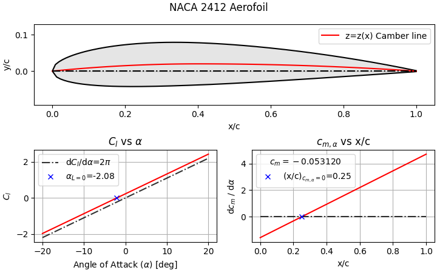

# Thin-aerofoil-theory Package

Tools for the inviscid analysis of aerofoils with "Thin aerofoil" theory.

## Windows Installation Instructions
> Using information from: 
> https://packaging.python.org/en/latest/tutorials/packaging-projects/ 
> https://packaging.python.org/en/latest/tutorials/installing-packages/ 
#### Preliminary setup
1. Download the package source files.
2. Open a command prompt inside the package folder.

#### Generating distribution archives
3. If no ".tar.gz" files exist in package/dist/, you need to type this in your command prompt. 
cmd > `py -m pip install --upgrade build` 
cmd > `py -m build` 

#### Installing a Local Package (without venv)
4. Follow these instructions to install the package, replacing path name and version number as appropriate. 
cmd > `py --version` 
cmd > `py -m pip --version` 
cmd > `py -m pip install --upgrade pip setuptools wheel` 
cmd > `py -m pip install ./downloads/thinaerofoils-yaseen157-x.x.x.tar.gz` 

## Windows Uninstallation Instructions
> Using information from: 
> https://pip.pypa.io/en/stable/cli/pip_uninstall/ 
1. Open a command prompt in the environment thinaerofoils is installed in. 
2. Type the following into the command prompt
cmd > `py -m pip uninstall thinaerofoils-yaseen157` 

---

## Hello World.
This package currently only supports 4-digit NACA aerofoils: 
py > `from thinaerofoils.inviscidanalysis import NACA4digit` 
py > `myfoil = NACA4digit(foil="2412")` 
py > `myfoil.show2()` 
 

